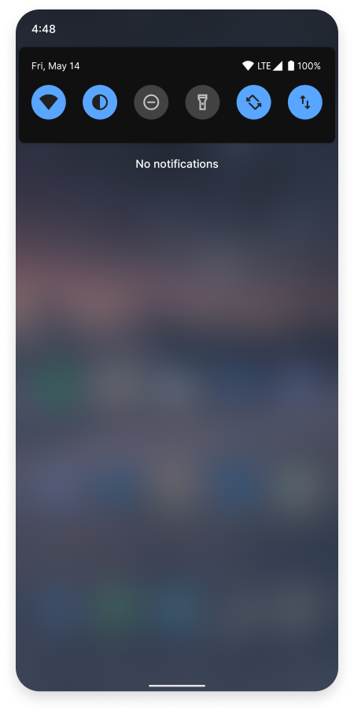
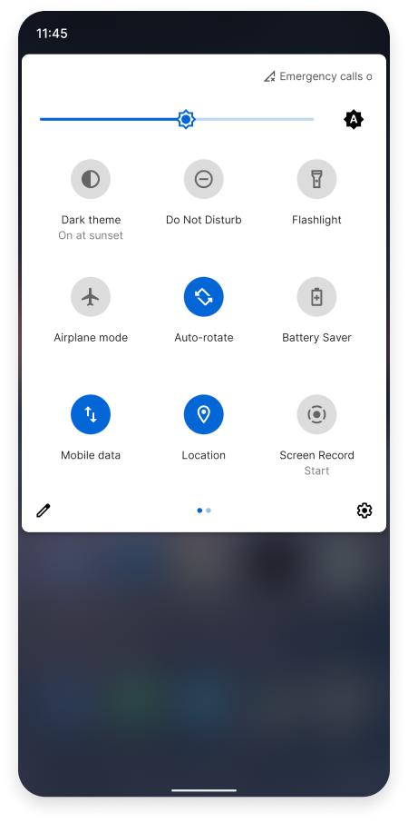
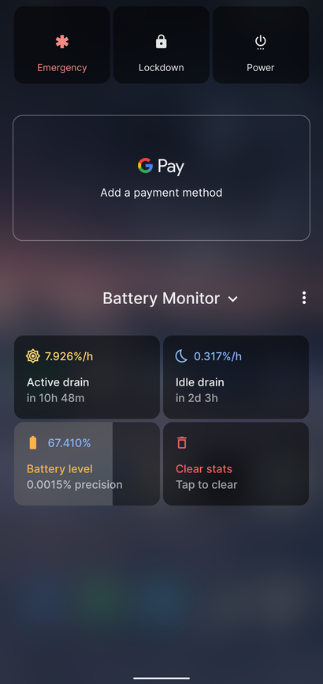
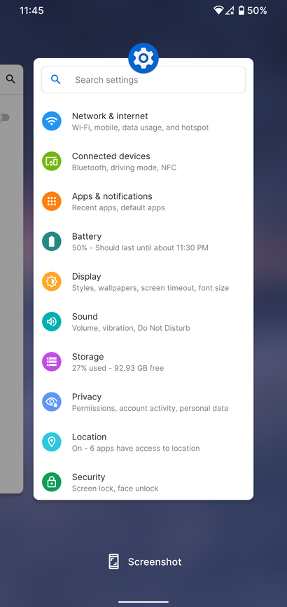

import clsx from 'clsx';
import styles from './screenshots.module.css';

# Overview

ProtonAOSP is a minimal Android fork (custom ROM) focused on UI/UX and performance, with a touch of privacy.

## Features

ProtonAOSP offers many improvements on the stock Android experience:

- [Better performance](features.md#performance)
- [Clean UI design](features.md#ui)
- [Improved memory management](features.md#memory)
- [Under-the-hood tweaks](features.md#tweaks)
- [Privacy](features.md#privacy)
- [Convenience](features.md#convenience)
- [Default experience](features.md#defaults)

It also keeps what you're used to on stock:

- SafetyNet passing out-of-the-box without root
- Some Pixel-exclusive features

See [Features](features.md) for more information.

## Screenshots

Get a taste of ProtonAOSP without installing it:

    
    
    
    

See [Screenshots](screenshots.mdx) for more details.

## Install

Installing ProtonAOSP is easy with our innovative [web installer](../getting-started/install/web.mdx), which makes for a quick and easy installation process takes as little as 4 minutes (depending on the speed of your internet connection). You don't need to know anything about Android to use the installer.

## Community

We have an [active and friendly community](community.md) on Telegram that anyone is free to join, should you have issues or just want to chat with other users.

There is also a comprehensive list of answers to [frequently asked questions](faq.md) that you may find useful. Feel free to take a look at the [FAQ](faq.md) or our other documentation pages if you're not sure whether ProtonAOSP is right for you.
