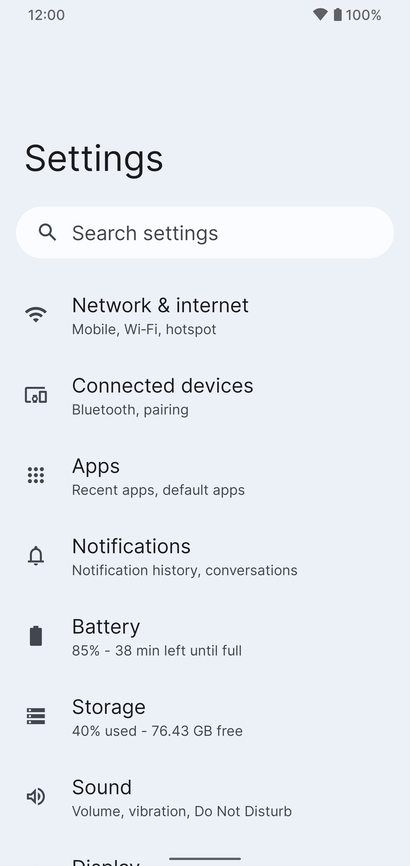
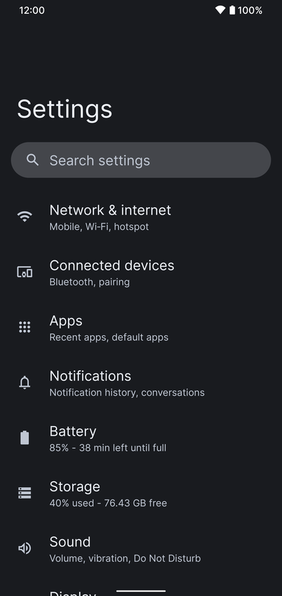
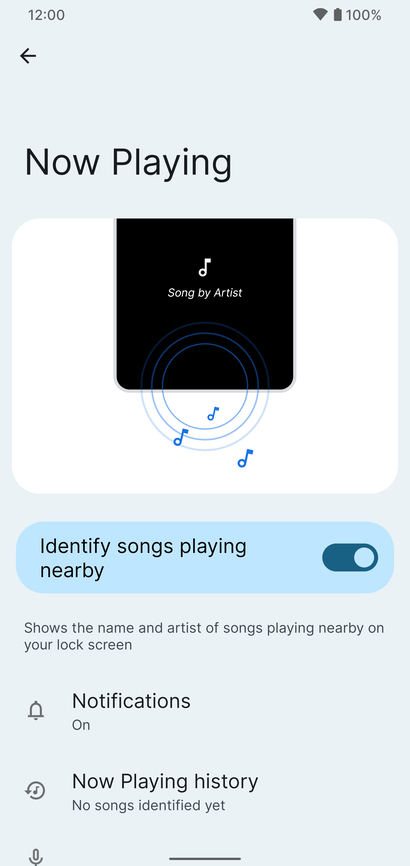

import clsx from 'clsx';
import styles from './screenshots.module.css';

# Screenshots

Here are some screenshots to get a taste of ProtonAOSP without having to install it yourself.

## System

### System UI elements

    
    
    
    

### Settings

    
    
    
    

### Privacy

    
    
    

## Wallpapers

### 2D wallpapers

    
    
    
    

### Photo wallpapers

    
    
    

## Sounds

    
    
    

## Default apps

    
    

## Features

### Pixel-exclusive

    
    

